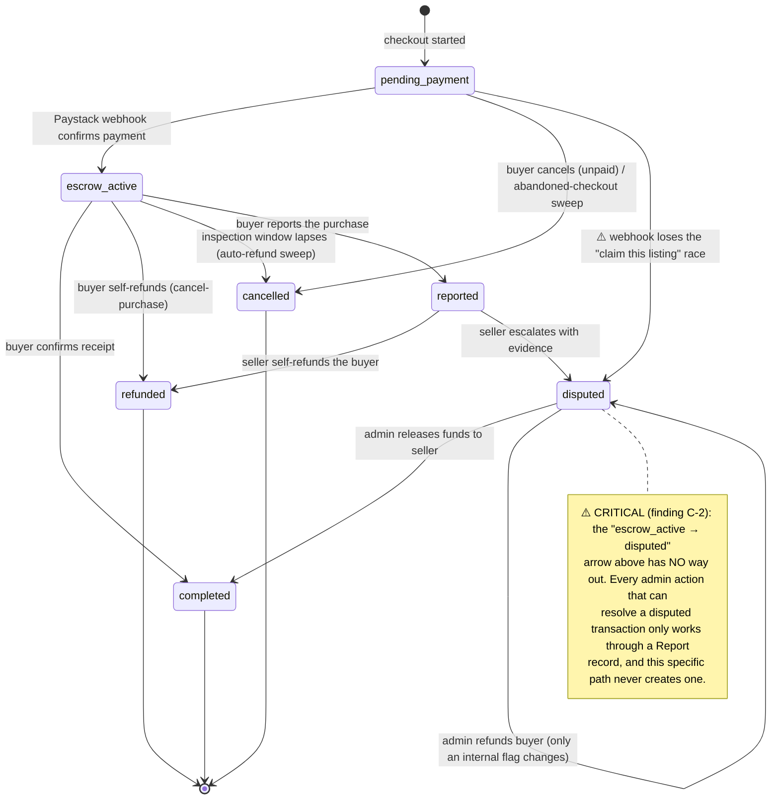
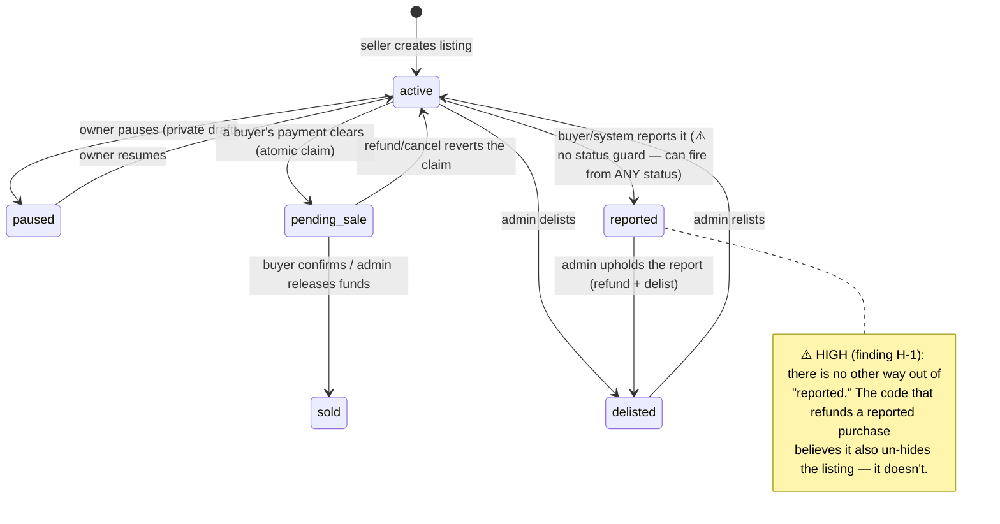
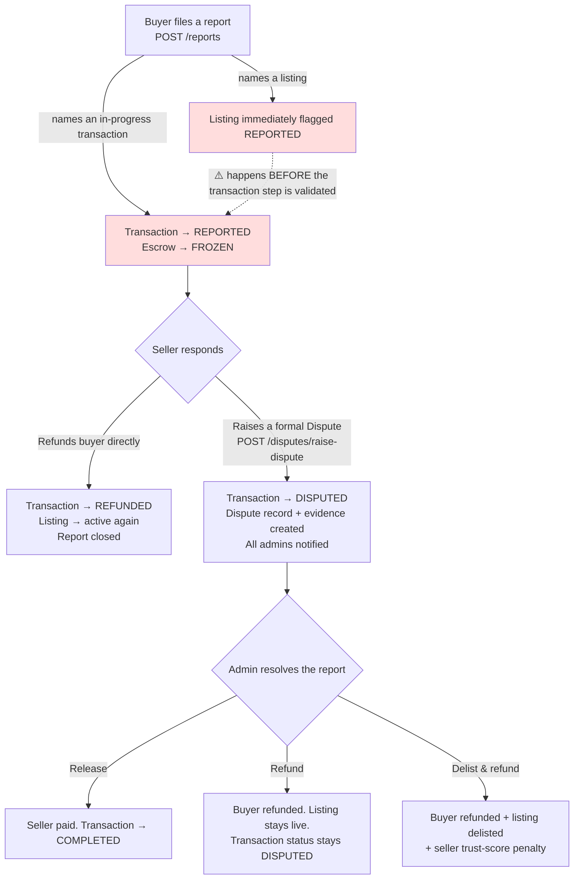
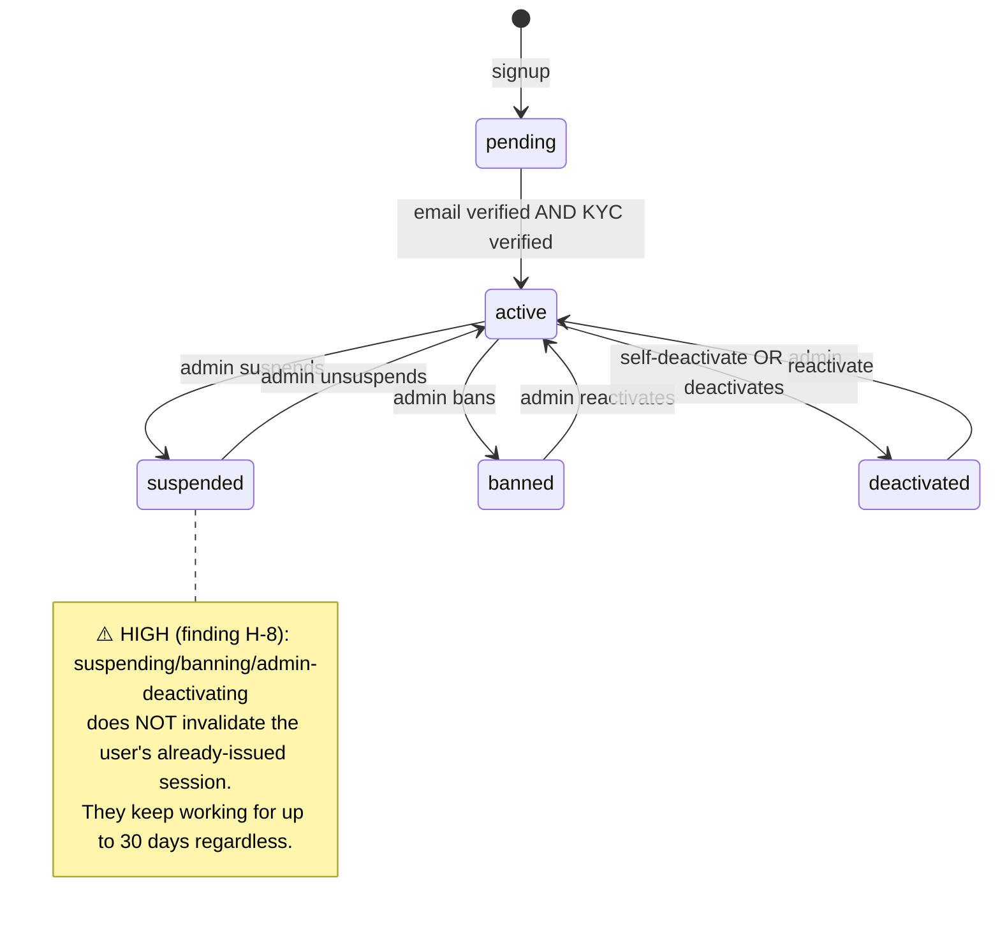

# Declut — User Flow & Codebase Review

**What this document is:** a plain-English walkthrough of how Declut actually works today, based on reading the real backend source code end to end — not on what any prior documentation *says* it does. Where the code disagrees with its own comments, or with itself across two places, that's called out explicitly. It closes with a ranked list of every inconsistency, redundancy, bug, and improvement opportunity found, so the team can decide what to fix before this carries real transactions.

**Who this is for:** written to be readable by a new engineer joining the project, and by a non-technical stakeholder (investor, co-founder) who wants to understand what the product actually does and how solid the foundation is — technical terms are explained inline the first time they appear.

**How this was produced:** the full `src/` tree (~40 modules) was split into six domains and each was read in full — every controller, service, DTO, and schema, not a skim — cross-checking code against its own comments and grepping the whole repository for real call sites before calling anything "dead" or "unused." The two most severe findings (an account-takeover path and a stuck-money bug) were independently re-verified by re-reading the exact lines myself before being included here as confirmed.

**Confidence key** used throughout: 🔴 **Critical** (real money or account-security exposure, right now) · 🟠 **High** (a real functional bug or design gap with a concrete bad outcome) · 🟡 **Medium** (a real inconsistency or missing safeguard, not actively dangerous today) · 🟢 **Low** (cleanup — dead code, stale comments, naming).

---

## Table of contents

1. [What Declut is, in one page](#1-what-declut-is-in-one-page)
2. [The two kinds of accounts](#2-the-two-kinds-of-accounts)
3. [The buyer & seller journey, end to end](#3-the-buyer--seller-journey-end-to-end)
4. [What happens when something goes wrong](#4-what-happens-when-something-goes-wrong-reports-disputes-refunds)
5. [The admin journey](#5-the-admin-journey)
6. [Behind the scenes: notifications, growth, support](#6-behind-the-scenes-notifications-growth-support)
7. [State machines (diagrams)](#7-state-machines)
8. [🔴 Critical findings](#8-critical-findings)
9. [🟠 High-severity findings](#9-high-severity-findings)
10. [🟡 Medium-severity findings](#10-medium-severity-findings)
11. [🟢 Low-severity findings (cleanup)](#11-low-severity-findings-cleanup)
12. [Recommended roadmap](#12-recommended-roadmap)
13. [Appendix: full endpoint reference](#13-appendix-full-endpoint-reference)

---

## 1. What Declut is, in one page

Declut is a marketplace for buying and selling secondhand household items, with one core promise: **the platform holds the buyer's money until the buyer confirms the item actually showed up.** This is the whole reason the product exists — without it, it's just a classifieds board with extra steps.

Concretely: a buyer pays through Paystack (Nigeria's dominant payment processor). That money doesn't go to the seller yet — it sits in an internal "escrow" record while the buyer and seller arrange to meet. Once the buyer is satisfied, they tap "confirm receipt," and *only then* does Declut trigger a bank transfer to the seller, minus a platform commission. If the buyer never confirms, or something goes wrong, there's a structured path to get the money back instead of it just disappearing into a seller's account.

Everything else in the app — listings, categories, KYC identity verification, trust scores, reviews, notifications, an admin back office — exists to support that one core loop safely: *pay in → hold → verify → release, or refund.*

The backend is a single NestJS (a structured Node.js framework) + MongoDB API. There's no web frontend in this repository — this is the API that a mobile app (buyers/sellers) and a separate admin web app both talk to.

---

## 2. The two kinds of accounts

There are exactly two identity systems, and they never overlap:

- **`User`** — every ordinary marketplace participant. There's no separate "buyer account" vs. "seller account" — one profile can do both; buyer/seller is just a role you play on a given transaction, not a fixed account type.
- **`Admin`** — internal staff only. Never self-registered; an admin can only be created by another already-existing admin. Runs on its own login, its own tokens, and its own set of permissions.

Both have a lifecycle of account states — `pending`, `active`, `suspended` (User only), `banned` (User only), `deactivated`. A brand-new account starts `pending` and only becomes `active` once it's proven itself: for a `User`, that means verifying their email **and** completing identity verification (KYC); for an `Admin`, it just means logging in successfully for the first time.

Admin also has a permission layer on top called RBAC (role-based access control): every admin is assigned a Role, and that Role says exactly which of ~15 areas of the app (users, listings, transactions, settings, etc.) they can view, modify, or delete. This is checked fresh from the database on every single admin request — not baked into their login token — so revoking access takes effect immediately, not on their next login. (There are two real gaps in how consistently this is applied — see [finding H-2](#9-high-severity-findings) and [C-4](#8-critical-findings).)

---

## 3. The buyer & seller journey, end to end

### 3.1 Signing up

Two paths, both converge on the same outcome (an access token + a refresh token, the standard "prove who you are on every request without logging in every time" pattern):

- **Email + password**: `POST /auth/register` takes email, password, name, and a Nigerian phone number. The account is created `pending`, and a 6-digit verification code is generated and emailed.
- **Google sign-in**: the mobile app signs in with Google, converts that into a Firebase session (a Google-owned identity service Declut uses only for this one purpose, plus push notifications), and hands the resulting token to `POST /auth/google`. Declut verifies it directly with Firebase and creates the account — already email-verified, since Google's email is pre-trusted.

Either way, the account is **not yet fully active** — that requires the second half below.

### 3.2 Verifying identity and building trust

- **Email verification**: the buyer/seller enters the 6-digit code (`POST /auth/verify-email`). This flips `emailVerified` to true.
- **KYC (identity verification)**: `POST /kyc/verify-nin` (national ID number check) and `POST /kyc/liveness-check` (a selfie-based "are you a real live person" check), each independently, via a third-party vendor (QoreID). Only once **both** are passed does the account become fully `active`. Until then, the account can still be logged into and browse, but the app is deliberately not letting it transact freely.
- **Trust score**: a single 0–100 number, recalculated automatically after key events (a completed sale, a new review, a KYC pass, a dispute). It rewards being verified, having a track record of completed sales, having good reviews, and having an account that's been around a while — and penalizes a high rate of disputes. It's not shown to end users as "here's how it's calculated" (to prevent gaming it), and today it doesn't gate anything (checkout, listing) — it's informational, surfaced only on the user's own profile.

### 3.3 Listing an item for sale

1. The seller requests a signed upload slip from Cloudinary (an image-hosting service) via `GET /media/upload-signature` — Declut's backend never touches the actual image bytes, only a signed permission to upload directly.
2. The seller uploads 1–3 photos and (optionally) one video straight to Cloudinary.
3. `POST /listings` creates the listing: title, description, category, price, condition (new / gently used), location (both a precise map point and a human-readable area/state), and the uploaded media. A "main image" is picked automatically (whichever photo was marked primary, or the first one).
4. The listing goes live immediately at status **active** — there's no admin approval gate before a listing is visible.

A seller can later **pause** a listing (a genuinely private draft state — invisible to literally everyone but the owner, not even shown to admins), **resume** it, edit it, or delete it — but only while it's `active`.

### 3.4 Discovering and buying

Buyers find listings through four feeds: a general search/filter, a "near me" feed (radius search), a "new" feed (recently posted), and a pure count endpoint. All four consistently hide: the viewer's own listings, listings the viewer previously bought and got refunded on, and listings from a **deactivated** seller (a gap here — see [H-3](#9-high-severity-findings)).

To buy: `POST /transactions` starts a Paystack checkout for the listing's list price. The transaction sits at **pending payment** until Paystack confirms the charge via a webhook (a server-to-server callback Paystack calls once money has actually moved). At that instant, two things happen atomically: the listing is claimed as "pending sale" (so a second buyer can't also check out on it), and an **escrow** record is created holding the money.

### 3.5 Escrow, confirmation, and payout

Once escrow is active, the buyer has an inspection window (admin-configurable, with one buyer-requested extension available) to meet the seller and check the item. Two ways this resolves cleanly:

- **The buyer confirms receipt** (`POST /transactions/:id/confirm-transaction`) — Declut transfers the sale amount to the seller's bank account, minus a platform commission, and the transaction is **completed**.
- **The buyer does nothing and the window lapses** — an hourly background job automatically cancels the transaction and refunds the buyer (minus a small flat fee), and the listing goes back to `active`.

The buyer can also self-serve a refund any time before that window closes (`POST /transactions/:id/cancel-purchase`, minus the same flat fee) — no seller approval needed.

### 3.6 Reviews

Once a transaction is completed, the buyer can leave a one-time, one-directional review of the seller (`POST /reviews`) — sellers never review buyers. This feeds the seller's cached average rating, shown on their profile, and feeds the trust score formula.

---

## 4. What happens when something goes wrong: reports, disputes, refunds

This is the most structurally important — and, per this review, the most fragile — part of the app. Three separate but related concepts:

- **A Report** (`POST /reports`) — a buyer flags a problem: a bad listing, a bad user, or (most importantly) a purchase currently in progress. If it names an in-progress transaction, that transaction and its escrow are immediately **frozen** — no further self-service action by either party is possible on it from that point.
- **A Dispute** (`POST /disputes/raise-dispute`) — the seller's formal escalation of a report, with two photos and a video of evidence, contesting the buyer's claim.
- **Admin resolution** — three actions an admin can take against a disputed case: release the money to the seller, refund the buyer, or refund the buyer **and** delist the seller's listing (with a trust-score penalty) for an upheld bad-faith report.

**The intended flow**, step by step:
1. Buyer reports a purchase → transaction status becomes `reported`, escrow freezes.
2. Seller has two choices: **refund the buyer directly** (no admin involved, case closed), or **raise a formal dispute** with evidence.
3. If disputed, every admin gets a real-time notification, and the case sits in an admin queue with a response-time SLA (a countdown the platform tracks against the seller, with a reminder nudge before it lapses).
4. An admin reviews the evidence and resolves it one of the three ways above.

**Where this breaks down in practice** — the review found two genuinely critical gaps in this exact flow, detailed in full in [Section 8](#8-critical-findings):

- A specific, real-world race condition (two buyers paying for the same listing at nearly the same instant) sends the losing buyer's transaction straight to "disputed" status *without* ever creating a Report — and every admin resolution action in the app today only works by resolving a Report. The result: that money has **no path anywhere in the product** to be released or refunded. It can only be fixed by someone manually intervening directly in the database or on Paystack's own dashboard, outside the app entirely.
- Filing a report against a listing flags/hides that listing as its very first action, *before* the rest of the report is validated — so a report that's guaranteed to fail (wrong transaction, wrong ownership) still leaves the target listing hidden, with no undo and no explanation left behind.

There's also a narrower but real gap: once a listing has been reported and the underlying purchase later gets refunded, the code that's supposed to bring the listing back to `active` only matches a different, earlier status — so the listing quietly gets stuck, invisible in every discovery feed and locked from being edited, paused, or deleted by its owner, forever (see [H-1](#9-high-severity-findings)).

---

## 5. The admin journey

Admins operate through a single, large back-office surface (`/admin/*`) covering: a dashboard (revenue trends, open disputes, escrow balance, category breakdown), user/listing/transaction management, KYC override, review moderation, reports/disputes resolution, a generalized "Activity Log" (an audit trail of who-did-what), platform settings (commission rate, fee toggles, SLA policy), role/permission management, content management (FAQ/banner entries), and a waitlist/feedback management surface.

The design intent, stated directly in the codebase, is that the main `AdminController` should be a *thin* layer — just deciding which underlying service to call, with no real business logic of its own. In practice this mostly holds, with a few real exceptions: the combined user+admin account list (explicitly acknowledged as an exception), a couple of large response-shaping methods, the dashboard's date-range math, and — more concerningly — several account-moderation actions that write their own audit-log entries directly rather than going through the domain they're acting on (see [M-3](#10-medium-severity-findings)).

Every admin route is meant to be gated two ways: "is this a valid staff login" and "does this admin's Role actually permit this specific action." The review confirmed this is applied consistently across the ~56 routes checked in the main admin surface — with two exceptions worth a deliberate sign-off rather than being left as an accident: creating a new admin account and reassigning any admin's access level currently require *no* specific permission at all, just *any* valid admin login (see [H-2](#9-high-severity-findings)), and a low-privilege admin can suspend, ban, or deactivate *any other admin account*, including the most senior one, because there's no separate permission bucket or hierarchy check for acting on staff accounts specifically (also [H-2](#9-high-severity-findings)).

---

## 6. Behind the scenes: notifications, growth, support

- **Notifications**: every meaningful event (payment received, funds released, dispute raised, KYC result, new review) can reach a user three ways — a push notification to their phone, an email, and a live update to an open app screen (via WebSockets, a technology for instant two-way updates without the app having to keep asking "anything new?"). Users can control push/email per category in their own settings. There's a second, older notification mechanism still wired up in two places (new-review, KYC result) that bypasses all of this — no inbox record, no user-level on/off control, no live screen update — inconsistent with everything else (see [H-9](#9-high-severity-findings)).
- **Waitlist**: a public pre-launch signup list with an admin-side single or bulk invite tool, and automatic conversion tracking once an invited person actually signs up.
- **Feedback**: a general in-app "tell us what you think / report a bug" box — this is genuinely unrelated to the Reports/Disputes system above (it has no link to any listing or transaction at all), though the naming overlap (`report_a_problem` as a feedback category vs. the separate `Report` entity) is worth cleaning up.
- **Contact**: a simple public "get in touch" form for the marketing site.

---

## 7. State machines

These diagrams describe what the code **actually does**, including the dead ends found during this review (marked explicitly). "→" is a transition a real function in the code performs; a status with no outgoing arrow is a genuine dead end today.

### 7.1 Transaction lifecycle

### 7.2 Listing lifecycle

### 7.3 Report → Dispute → Resolution

### 7.4 Account status (User)

---

## 8. Critical findings

These are the findings that represent real, present-day exposure — money that can get stuck with no recovery path, or a real account-takeover surface. All four were independently confirmed by directly reading the cited source lines, not taken on the sub-review's word alone.

### C-1 — Forgot-password hands back the actual OTP / reset link in the API response, for both regular users and admins

**Where:** `src/auth/auth.service.ts:246-304` (`forgotPassword`), `src/admin-auth/admin-auth.service.ts:481-522` (`forgotPassword`)

**What's happening, in plain terms:** when someone requests a password reset, the correct design is "we email you a code/link, and only your inbox has it." Instead, both endpoints build the *entire email* (subject + HTML body, containing the real 6-digit code for a regular user, or the real clickable reset link with its secret token for an admin) and return it **directly in the HTTP response**, every single time, unconditionally — not gated behind a "only in development" check.

**Why it's critical:** anyone who knows (or guesses) a target's email address can call `POST /auth/forgot-password` (or the admin equivalent) and immediately receive a working password-reset credential in the response — no access to that person's inbox required at all. For the admin endpoint specifically, several real admin email addresses are already documented in this project's own history, making this a directly actionable account-takeover path against staff accounts, not just a theoretical one.

**Verified directly:** yes — read both functions end to end; the `emailPreview` field is built and returned in every branch with no environment check anywhere in either method.

**Fix:** stop returning `emailPreview` in the response body at all (or gate it strictly behind `NODE_ENV !== 'production'`, and even then, log it server-side instead of echoing it to the caller — this codebase already uses that safer pattern elsewhere for other dev-mode OTP visibility).

### C-2 — A specific race condition sends real, already-collected money into a status with zero resolution path

**Where:** `src/transactions/transactions.service.ts:380-425` (the webhook's listing-claim race, sets `DISPUTED` directly), `src/transactions/transactions.service.ts:826-849` (`reportPurchase`, requires the transaction to still be `escrow_active`/`awaiting_inspection` — excludes `disputed`), `src/reports/reports.service.ts:319-361` (the only three call sites for the admin release/refund/delist actions, all of which require an existing Report), `src/transactions/transactions.service.ts:2673,2822,2879` (`adminRelease`/`adminRefund`/`adminDelistAndRefund`, all hard-require `status === DISPUTED`)

**What's happening, in plain terms:** if two buyers both pay for the same listing within the same narrow window, only one wins the "claim this listing" race — correctly, only one sale should go through. But the *loser* already successfully paid Paystack. Their transaction is flagged `disputed` for what the code's own comment calls "an explicit admin decision" — except no admin decision is actually reachable. Getting a case in front of an admin today requires a **Report** record to exist, and a Report can only be created against a transaction that's still `escrow_active` — which this one, by definition, never was (it went straight to `disputed`). The buyer can't self-refund either (that path also excludes `disputed`).

**Why it's critical:** this is real money, already collected by Paystack, sitting in a state that no button, no admin screen, and no automated job in the entire application can move. The only way out today is a developer or ops person manually editing the database or intervening directly on Paystack's dashboard — completely outside the product.

**Verified directly:** yes — traced the exact code path from the webhook, confirmed `reportPurchase`'s status guard excludes `disputed`, and confirmed via search that the three admin resolution methods have no caller anywhere except the Report-gated ones.

**Fix:** either have the webhook's race-loss branch create a minimal Report record of its own (so the existing resolution flow can reach it), or restore a resolution path keyed directly by transaction ID as a fallback for a disputed transaction with no Report behind it.

### C-3 — Any logged-in user can permanently delete any other seller's listing photos/video

**Where:** `src/media/media.controller.ts:26-29`, `src/cloudinary/cloudinary.service.ts:57-77`

**What's happening, in plain terms:** `DELETE /media/image` deletes an image from Cloudinary (the image hosting service) by its file ID. That file ID is not secret — it's returned as part of every ordinary listing you can view. The delete endpoint only checks "is this a logged-in user," never "does this file actually belong to something you own."

**Why it's critical:** any buyer browsing the app can view a seller's listing, copy the image ID out of the response, and call this endpoint to permanently delete that seller's photo from Cloudinary — breaking their live listing, with no audit trail pointing back to who did it.

**Fix:** before calling Cloudinary's delete, look up which `Listing` (or user profile image) that file ID actually belongs to, and confirm the caller owns it.

### C-4 — Filing a report can hide an arbitrary listing even when the report itself fails

**Where:** `src/reports/reports.service.ts:84-104`

**What's happening, in plain terms:** `POST /reports` does two separate things when a report names both a listing and a transaction: it flags the listing as `reported` (hiding it from all discovery feeds and notifying the seller) — and only *afterward* checks whether the transaction part of the request is actually valid (right owner, right status, etc.). If that second check fails, the whole request errors out — but the listing has already been hidden, and no `Report` document is ever actually saved to explain why.

**Why it's critical:** this is directly exploitable — any logged-in user can hide a competitor's or a disliked seller's listing on demand by submitting a request that's guaranteed to fail validation (e.g., naming someone else's transaction ID), with zero record left behind of what happened or who did it.

**Fix:** validate the transaction/eligibility checks *before* touching the listing's status, or wrap the whole operation so a failure undoes the listing flag.

---

## 9. High-severity findings

### H-1 — A refunded "reported" listing can never come back to active

**Where:** `src/listings/listings.service.ts:1247-1266` (`revertToActive`, only matches status `pending_sale`), called from `src/transactions/transactions.service.ts:906-939` and `:2822-2832` while the listing is actually sitting at `reported`

Both refund paths for a reported purchase (seller self-refund, and admin refund) call a method that's supposed to bring the listing back to `active` — but that method's guard only matches a *different* status (`pending_sale`), so the call is a silent no-op. The listing is left permanently stuck at `reported`: invisible in every discovery feed, and blocked from being edited, paused, or deleted by its own owner (all of which require `active`). The one method that *would* close this gap (`unreport()`) exists in the code but has zero callers anywhere — confirmed dead.

**Fix:** make the revert logic handle both starting statuses, or route this specific case through a status-aware version of it.

### H-2 — Any admin can create new full-access admins or reassign anyone's role, and a low-privilege admin can suspend/ban/deactivate any other admin (including the top-level one)

**Where:** `src/admin-auth/admin-auth.controller.ts` (`POST /admin/auth/sub-admins`, `PATCH /admin/auth/sub-admins/:id/role` — no `@RequirePermission` at all), `src/admin/admin.service.ts:365-480` (unified deactivate/reactivate, resolves to either a `User` or an `Admin` target with no hierarchy or self-action check, gated only on the generic `users` permission bucket)

Two related gaps: (1) creating a brand-new admin account, or changing *any* admin's role/permission level, requires nothing beyond "is logged in as some admin" — no specific permission check at all. This is called out in the code as an accepted trade-off ("an admin could already grant itself full access indirectly by creating a full-permission sub-admin anyway"), which is a defensible call for a small trusted team — but it should be a deliberate, written-down decision, not something discovered by reading the code. (2) Separately, the newer unified account-moderation actions (deactivate/reactivate/suspend/ban) resolve their target to either a marketplace user *or* a staff admin and act on either — meaning a sub-admin who was only ever granted the ordinary `users` permission can suspend, ban, or deactivate the most senior admin account in the system, with no hierarchy check anywhere.

**Fix:** either accept and document (1) explicitly, or add a minimum-permission check; for (2), add a self-action guard and consider a dedicated permission bucket for actions targeting staff accounts, distinct from actions targeting marketplace users.

### H-3 — Banned and suspended sellers' listings still show up for buyers

**Where:** `src/listings/listings.service.ts:761-765` (`getDeactivatedSellerIds`)

The four discovery feeds correctly hide listings from a **deactivated** seller — but a seller who's been **banned** or **suspended** (both real, distinct, and presumably more serious account states) is not excluded at all. Their listings remain fully browsable and purchasable.

**Fix:** extend the exclusion to cover banned (and likely suspended) sellers too.

### H-4 — Platform settings and permission changes leave no audit trail

**Where:** `src/settings/settings.service.ts` (no `AuditLogService` usage anywhere), `src/roles/roles.service.ts` (same)

The app has a generalized activity log specifically so that money- and access-adjacent admin actions are always resolvable later — and nearly every admin-mutating module writes to it. Two conspicuous exceptions: changing the platform commission rate, toggling payment methods, editing the dispute-SLA policy (all via Settings), and granting or revoking a Role's permissions (RBAC) — arguably the two most sensitive categories of admin action in the app — currently leave **zero** record of who changed what, when.

**Fix:** wire both services into the existing `AuditLogService`, matching every other admin-mutating module.

### H-5 — A failed or interrupted payout leaves absolutely no trace

**Where:** `src/transactions/transactions.service.ts:533` (`confirmReceipt`), `:2706` (`adminRelease`) — both call `releaseToSeller()` directly, unlike the refund path

Every refund in the app goes through one shared helper that *always* records something — even a failed attempt gets a "failed" row so it's visible later. The equivalent for paying the seller has no such safety net: if the Paystack transfer call throws (including a timeout where Paystack may have actually processed it but the response never arrived), nothing is written anywhere — no payout record, no audit entry, no status change. A background job reconciles *existing* pending payout records every 15 minutes, but it can't rescue a payout that was never recorded in the first place.

**Fix:** wrap the release call the same way the refund path already is — always write a record, success or failure.

### H-6 — "Money currently held in escrow" is calculated two different, disagreeing ways

**Where:** `src/transactions/transactions.service.ts:3204-3233` (dashboard escrow balance) and `src/users/users.service.ts:506-523` (a user's own "total in escrow" stat) both only count `escrow_active`/`awaiting_inspection` transactions — versus `src/escrow/escrow.service.ts:216-222`, which correctly also counts `frozen` (i.e., disputed) escrow as still-held money

The admin dashboard's "Escrow Balance" card and a user's own profile stat both **understate** real money currently held by the platform the moment any transaction is disputed — that money hasn't gone anywhere, it's just not being counted. Relatedly, the dashboard's "Open Disputes" count never decreases when a dispute is resolved by admin refund (as opposed to release), because that action deliberately never changes the transaction's main status — so resolved disputes stay counted as open forever.

**Fix:** make both "money held" calculations source from the same definition (ideally the Escrow collection's own, which is already correct), and make the open-disputes count also check the resolution flag, not just the raw status.

### H-7 — A reported purchase has no forced resolution if the seller just does nothing

**Where:** confirmed via full-repository search — no cron job, timeout, or admin action operates on a transaction sitting at `reported`

Once a purchase is reported, the seller has two options (refund or dispute) — but nothing requires them to actually choose one. There's a response-time SLA that sends the seller a reminder, but per the code's own comment, automatic escalation past that deadline was explicitly built and then deliberately removed. If a seller simply never responds, the buyer's money sits frozen indefinitely with no automatic path forward.

**Fix:** add a genuine timeout outcome (even just auto-opening a dispute for admin attention, or auto-refunding after a longer grace period) once the SLA lapses.

### H-8 — Banning, suspending, or admin-deactivating an account doesn't end their current session

**Where:** `src/users/users.service.ts:226-247,341-349,354-371` (suspend/deactivate/ban — none clear the stored refresh token), `src/admin-auth/admin-auth.service.ts:233-235,276-288` (the admin equivalent) — contrast with `deactivateOwnAccount()`, which does clear it

Login and page-load checks are pure token-signature checks with no database lookup — by design, for speed. That's fine as long as every path that changes an account's standing also invalidates its existing session. Only *self*-deactivation actually does that. An admin-triggered suspension, ban, or deactivation leaves the target's current session fully functional — they can keep refreshing their token and using the app normally for up to the full session lifetime (30 days) after being banned, because the one endpoint that could catch this (`refresh`) never checks account status either.

**Fix:** clear the stored refresh token as part of every punitive account-status change, the same way self-deactivation already does; consider also having `refresh()` re-check status as defense in depth.

### H-9 — Two different notification systems still coexist, and two real event types quietly use the weaker one

**Where:** `src/reviews/reviews.service.ts:87` ("new review received"), `src/kyc/kyc.service.ts:124` (KYC pass/fail result) — both still call the older, simpler push-only sender instead of the current, full-featured one every other event in the app uses

The app was rebuilt around a richer notification path that saves an in-app inbox entry, respects each user's own push/email preferences, and live-updates any open app screen. Two events — getting a new review, and finding out your KYC passed or failed — never got migrated, and still use the older mechanism, which does none of those three things. A user who just got KYC-verified gets a push notification (if configured) but no record of it anywhere in their notification history.

**Fix:** move these two call sites onto the current notification path — a small, low-risk change since the shape is identical.

---

## 10. Medium-severity findings

| # | Finding | Where |
|---|---|---|
| M-1 | An admin can force a Report's status to any value, including "disputed," without a real Dispute ever existing — and can reopen an already-resolved/dismissed report with no cleanup of related fields. | `src/reports/dto/update-report-status.dto.ts`, `src/reports/reports.service.ts:243-277` |
| M-2 | The combined User+Admin CSV export silently truncates past 10,000 combined rows — the exact same bug already found and fixed once elsewhere in this codebase (Categories export), reintroduced here. | `src/admin/admin.service.ts:218-234` |
| M-3 | Several admin lifecycle actions (suspend, ban, KYC override) write no audit-log entry, while near-identical sibling actions in the very same file (deactivate, reactivate, unsuspend) do. | `src/admin/admin.service.ts:349-352,403-406,503-509` vs. `:365-480` |
| M-4 | The permission-check guard silently allows access by default on any admin route that forgets to declare a required permission — currently no route was found missing it, but there's no safety net if one is added carelessly in future. | `src/admin-auth/guards/permissions.guard.ts` |
| M-5 | The filterable "entity type" list on the admin Activity Log page is missing 6 real categories of event actually being logged (user, admin, feedback, dispute, bank account, notification broadcast) — those rows exist and show up unfiltered, but can't be filtered to. | `src/audit-log/schemas/audit-log.schema.ts:11-17` |
| M-6 | Nearly every money-moving action reads a transaction's status, decides, and only writes much later — with no atomic "claim" step in between. Two truly simultaneous requests for the same action (a double-tap, a retried click) could both pass the check and both call Paystack; protection currently depends entirely on Paystack itself treating a repeated reference as a no-op, which isn't verified anywhere in this codebase. | across `transactions.service.ts` |
| M-7 | The one background job that actually moves money (auto-refunding an expired inspection window) has no atomic per-transaction claim, unlike a sibling method in the same file — two overlapping runs of that hourly job could double-refund the same transaction. | `src/transactions/transactions.service.ts:2950-2982` |
| M-8 | Creating a transaction and creating its linked escrow record happen as two separate database writes with no all-or-nothing guarantee (this codebase doesn't use database transactions anywhere) — a crash between the two leaves an active transaction with no linked escrow, forever silently orphaned. | `src/transactions/transactions.service.ts:427-452` |
| M-9 | The Paystack "subaccount" integration used at checkout does nothing — it's configured to split 0% of the payment, and the real seller payout goes through a completely separate, direct bank transfer call. It's dead integration weight, not a bug, but worth removing or actually wiring up. | `src/transactions/transactions.service.ts:207`, `src/payments/paystack.service.ts:130-131` |
| M-10 | The admin password-reset form has a "confirm new password" field that's required by validation but never actually compared against the new password — a mismatched confirmation is silently accepted. | `src/admin-auth/dto/admin-reset-password.dto.ts`, `src/admin-auth/admin-auth.service.ts:529-557` |
| M-11 | `TransactionNote` (admin notes on a transaction) and `FeedbackNote` (admin notes on a feedback item) are field-for-field identical schemas with duplicated service logic (including the same "only the author can edit/delete" rule) — a strong candidate to become one shared, reusable capability, the same way the activity log itself was already generalized. | `src/transactions/schemas/transaction-note.schema.ts`, `src/feedback/schemas/feedback-note.schema.ts` |
| M-12 | The public, unauthenticated `GET /settings` endpoint advertises 5 configuration fields (card payments on/off, bank transfer on/off, buyer service fee %, escrow release fee, minimum payout threshold) that nothing in the backend actually reads anywhere — a client could reasonably build real UI behavior around a toggle that has zero effect. | `src/settings/schemas/app-settings.schema.ts`, confirmed via repo-wide search |
| M-13 | Creating a formal Dispute has no protection against a duplicate/simultaneous submission — unlike the near-identical situation in Reviews, which cleanly returns a "already exists" error, this one would surface as a raw server error. | `src/disputes/disputes.service.ts:49-56` |

---

## 11. Low-severity findings (cleanup)

These aren't dangerous today, but each is a real trap for the next person who reads the code and trusts a comment or a name at face value.

- **Stale/wrong comments describing the opposite of what the code does**, found in 4 separate places: the inspection-extension endpoint's controller comment describes the exact opposite guard direction from what the service actually enforces (`transactions.controller.ts:131-133`); the "reverts a transaction to active" comment above the refund/record helper claims a narrower set of callers than the 4 that actually exist (`transactions.service.ts:2219-2226`); the "new listings" feed's own comment says a 7-day window while the code uses 14 days (`listings.service.ts:673`); the view-counter's controller comment says "once per hour" while the code enforces once per 24 hours (`listings.controller.ts:90-92`).
- **Confirmed dead code left in place with misleading comments** claiming an active caller that doesn't exist: `ListingsService.unreport()` and `ListingsService.adminFindByIdWithCategory()` (`listings.service.ts:1336-1360,1165-1177`); the `AWAITING_INSPECTION` transaction status, declared in the enum and referenced defensively in a few guards, but never actually assigned to a transaction anywhere in the codebase; an orphaned DTO file, `src/admin/dto/admin-refund.dto.ts`, left over from a since-redesigned flow.
- **Stale comments claiming an unbuilt feature**, for functionality that's actually been live for weeks: the Waitlist schema's comment on "joined" status (`waitlist.schema.ts:12-14`) and the Notification Settings schema's comment claiming "nothing reads these yet" (`notification-setting.schema.ts:16`).
- **A destructive-sounding but actually cosmetic status guard gap**: `Listing.report()` has no status guard at all, unlike every sibling status-changing method — meaning it can (a) flip an already-paused *private draft* listing into the reported queue, technically breaking its "invisible to everyone but the owner" guarantee, and (b) fire against an already-sold or already-delisted listing with no real effect. Worth a guard, lower urgency than the C-4/H-1 issues above since it doesn't move money.
- **Naming/parameter drift**: `Listing.report()`/`unreport()`'s second parameter is still called `adminId` even though only ordinary users call it today, since the admin-facing version of these routes was removed (`listings.service.ts:1297,1336`).
- **Two unrelated concepts sharing confusingly similar names**: `Feedback`'s `report_a_problem` category vs. the entirely separate `Report` entity that drives the dispute system; `Review.rating` (how good was this seller) vs. `Feedback.experience` (how good is the app) — both "1 to 5 stars," measuring different things.
- **A frozen counter still being exported as if live**: `Listing.saves` stopped being updated the day the Favorites feature was removed, but the admin CSV export still includes it as a column with no indication it's a historical snapshot, not a current number.
- **Duplicated boilerplate between the two WebSocket connection handlers** (the admin notification bell and the general live-update channel) — the token-extraction logic is copy-pasted byte-for-byte between them.
- **A few genuinely dormant fields/settings**: `maxCodeAttempts` and `autoEscalateSlaOnExpiry` in platform settings are editable via the admin UI but read by nothing; `listingActivity`/`productUpdates` notification categories are stored and returned but currently gate nothing; a `company` field appears in every transaction-party response shape but has no write path anywhere, so it's always empty.
- **A dormant search index**: the old full-text search index on listings (`title`/`description`) is still declared on the schema, still paying a small write-cost on every listing save, even though search switched to a different approach months ago and nothing reads this index anymore.

---

## 12. Recommended roadmap

**Before this touches real money / real users in production:**
1. Fix C-1 (forgot-password credential leak) — this is a same-day fix.
2. Fix C-2 (unreachable disputed transactions) — needs a product decision on which recovery path to build, but shouldn't ship as-is.
3. Fix C-3 (media delete ownership check) — same-day fix.
4. Fix C-4 (report-before-validate listing flag) — reorder two lines of logic.

**Next priority — closes real gaps in the safety/trust system:**
5. H-1 (stuck reported listings), H-3 (banned sellers still buyable), H-7 (no forced exit for ignored reports) — these three together are really one theme: the report/dispute system needs its edge cases closed.
6. H-4 (settings/RBAC audit logging), H-2 (admin privilege boundaries) — both are about making sure the admin side of the house is as accountable as it's designed to be.
7. H-5 (silent payout failures), H-6 (disagreeing escrow-balance math) — both are about the numbers the team relies on being trustworthy.
8. H-8 (sessions surviving a ban) — a real, if narrow, security gap.
9. H-9 (consolidate the two notification systems) — smaller effort, real consistency win.

**Then, as capacity allows:** the Medium list (concurrency safety around money movement, the duplicate-note-schema cleanup, dead settings/config cleanup) and the Low list (comment accuracy, dead code removal) — none of these are urgent, but several of the "stale comment describes the opposite of the real behavior" items are worth fixing quickly since they actively mislead anyone (human or AI) reading the code next.

---

## 13. Appendix: full endpoint reference

Every route below sits under the global `/api` prefix (e.g. the first row is really `POST /api/auth/register`). Grouped by domain, in the rough order a user would encounter them.

### Identity & access

| Method | Path | Who | Purpose |
|---|---|---|---|
| POST | `/auth/register` | public | Email/password signup |
| POST | `/auth/login` | public | Email-or-phone + password login |
| POST | `/auth/google` | public | Google (via Firebase) sign-in |
| POST | `/auth/refresh` | public | Rotate access/refresh tokens |
| POST | `/auth/logout` | logged-in user | End session |
| POST | `/auth/forgot-password` / `/resend-otp` / `/verify-otp` / `/reset-password` | public | Password reset chain |
| PATCH | `/auth/change-password` | logged-in user | In-app password change |
| POST | `/auth/verify-email` / `/resend-verification-email` | logged-in user | Email verification |
| GET | `/users/me` | logged-in user | Own full profile + stats |
| PATCH | `/users/me` | logged-in user | Update name/photo |
| POST | `/users/me/deactivate` | logged-in user | Self-deactivate |
| GET | `/users/:id` | logged-in user | Another user's public profile |
| POST | `/kyc/verify-nin` / `/liveness-check` | logged-in user | Identity verification |
| GET | `/kyc/history` | logged-in user | Own verification attempts |
| POST | `/admin/auth/login` | public | Staff login |
| POST | `/admin/auth/refresh` / `/logout` | admin | Session management |
| POST/GET | `/admin/auth/forgot-password` / `/verify-reset-token/:token` / `/reset-password/:token` | public | Staff password reset |
| GET/PATCH | `/admin/auth/me`, `/me/general`, `/me/dashboard-preferences` | admin | Own profile |
| POST | `/admin/auth/me/deactivate` | admin | Self-deactivate |
| PATCH | `/admin/auth/change-password` | admin | In-app password change |
| POST/PATCH | `/admin/auth/sub-admins`, `/sub-admins/:id/role` | admin | Create staff / reassign role — see finding H-2 |

### Marketplace & discovery

| Method | Path | Who | Purpose |
|---|---|---|---|
| GET | `/listings` / `/nearby` / `/new` / `/count` | logged-in user | The 4 discovery feeds |
| GET | `/listings/mine` | logged-in user | Own listings |
| GET | `/listings/:idOrSlug` | logged-in user | Listing detail |
| POST | `/listings/:idOrSlug/view` | logged-in user | Register a view |
| POST | `/listings` | logged-in user | Create a listing |
| PATCH | `/listings/:id` / `/:id/pause` / `/:id/resume` | owner | Edit / pause / resume |
| DELETE | `/listings/:id` | owner | Delete (only from active) |
| GET | `/listings/public/:slug` | public | OG/metadata preview |
| GET | `/media/upload-signature`(`/bulk`) | logged-in user | Get a Cloudinary upload slip |
| DELETE | `/media/image` | logged-in user | Delete an image — see finding C-3 |
| GET | `/categories`, `/categories/all` | public / logged-in | Browse categories |
| GET/POST/PATCH/DELETE | `/admin/categories*` | admin | Manage categories |

### Money core

| Method | Path | Who | Purpose |
|---|---|---|---|
| POST | `/transactions` | buyer | Start checkout |
| POST | `/transactions/webhook/paystack` | Paystack only | Payment confirmation |
| GET | `/transactions`, `/transactions/purchases`, `/transactions/:id`, `/transactions/by-reference/:reference` | either party | View transactions |
| POST | `/transactions/:id/confirm-transaction` | buyer | Release funds to seller |
| POST | `/transactions/:id/add-inspection-extension` | buyer | Extend inspection window once |
| PATCH | `/transactions/:id/cancel` | buyer | Cancel before payment |
| POST | `/transactions/:id/cancel-purchase` | buyer | Self-refund after payment |
| POST | `/transactions/:id/seller-refund` | seller | Refund a reported purchase |
| POST | `/reports` | logged-in user | File a report |
| POST | `/disputes/raise-dispute` | seller | Escalate a report |
| GET/PATCH/POST | `/admin/reports*`, `/admin/reports/:id/resolve/*` | admin | Resolve disputes |
| GET/PATCH/DELETE | `/admin/transactions*`, `/admin/transaction-notes*` | admin | Transaction oversight |
| GET | `/admin/escrows*` | admin | Escrow oversight |
| POST/PATCH/DELETE/GET | `/bank-accounts*`, `/banks*` | logged-in user | Payout destination |

### Reviews & feedback

| Method | Path | Who | Purpose |
|---|---|---|---|
| POST | `/reviews` | buyer | Review a seller |
| GET | `/reviews/listing/:listingId`, `/reviews/user/:userId` | logged-in user | Own reviews |
| GET/PATCH | `/admin/reviews*` (inside `admin.controller.ts`) | admin | Moderate reviews |
| POST/GET | `/feedback` | logged-in user | Submit / view own app feedback |
| GET/PATCH | `/admin/feedback*`, `/admin/feedback-notes*` | admin | Manage feedback |

### Admin operations & platform config

| Method | Path | Who | Purpose |
|---|---|---|---|
| GET | `/admin/dashboard/*` (6 routes) | admin | KPIs, revenue, breakdowns |
| GET/PATCH | `/admin/users*` | admin | User/admin account management |
| GET | `/admin/settings`, PATCH `/admin/settings/{general,payments,fees-and-commission,issue-resolution-sla}` | admin | Platform config |
| GET | `/settings` | public | Curated public subset of config |
| GET/DELETE | `/admin/activity-log*` | admin | Audit trail |
| GET/POST/PATCH/DELETE | `/admin/roles*` | admin | RBAC role management |
| GET/POST/PATCH/DELETE | `/admin/content*` | admin | CMS blocks (FAQ/banners) |

### Notifications, growth & support

| Method | Path | Who | Purpose |
|---|---|---|---|
| POST/DELETE | `/notifications/register-token`, `/notifications/token/:token` | logged-in user | Push device registration |
| GET/PATCH | `/notifications`, `/notifications/:id/read` | logged-in user | Own inbox |
| GET/PATCH | `/admin/notifications*` | admin | Own inbox |
| GET/DELETE | `/admin/notification-broadcasts*` | admin | Bulk-broadcast log |
| GET/PATCH | `/notification-settings/user/:userId` | logged-in user | Own channel preferences |
| POST | `/waitlist` | public | Join waitlist |
| GET/POST/DELETE | `/admin/waitlist*` | admin | Manage waitlist |
| POST | `/contact` | public | "Get in touch" form |

---

*Document generated by a full read-through of the `src/` tree as it stands today. If the codebase changes, this document will drift — treat it as a snapshot, not a live source of truth, and re-run this review periodically rather than hand-editing this file piecemeal.*
